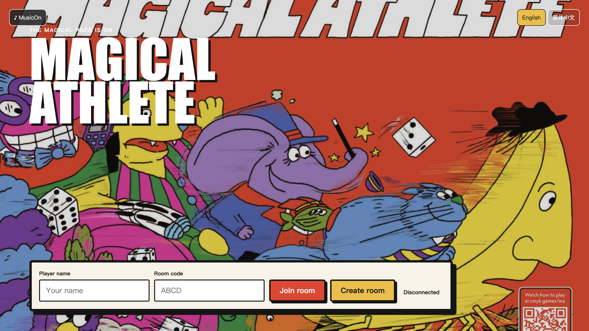
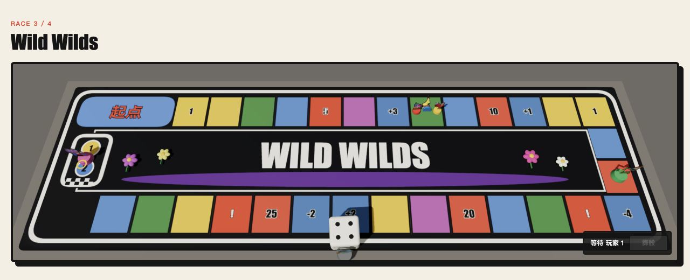
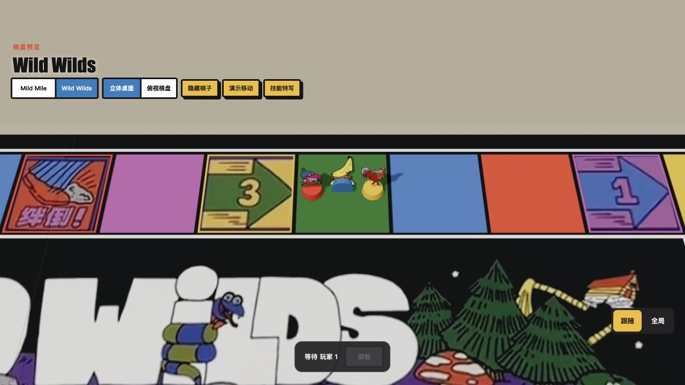
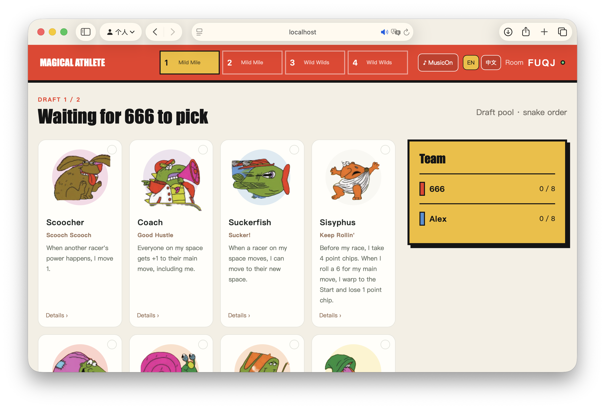

<h1 align="center">Magical Athlete Online</h1>

<h3 align="center">把充满魔力的胡闹运动会，带到每个人的浏览器里</h3>

<p align="center">
  <a href="https://xeonliu.github.io/MagicalAthleteOL/"><b>在线游玩</b></a> |
  <a href="docs/rules.md"><b>玩法规则</b></a> |
  <a href="docs/protocol.md"><b>通信协议</b></a> |
  <a href="#架构"><b>项目架构</b></a>
</p>

<p align="center">
  <a href="https://github.com/xeonliu/MagicalAthelete/actions/workflows/deploy.yml"></a>
  
  
  
  
</p>

<p align="center">
  <a href="https://xeonliu.github.io/MagicalAthleteOL/">
    
  </a>
</p>

## 关于

Magical Athlete Online 是 [CMYK 同名桌游](https://www.cmyk.games/products/magical-athlete) 的网页实现，支持 **2–6 人实时联机**。创建四位房间号、邀请朋友加入，然后经历公开蛇形招募、秘密选将和四场充满意外的魔法竞速。

本游戏掷骰、移动、角色能力、计分和阶段推进在服务器进行处理，保证每位玩家看到同一场比赛。

## 核心特性

- **完整比赛流程**：公开招募、秘密选将、四场固定赛程与累计积分一站完成。
- **36 名魔法赛车手**：复用 `magsim` 规则实现，每名角色都有独立的互动能力。
- **实时多人房间**：WebSocket 广播状态，支持断线重连、身份恢复与行动去重。
- **服务端权威判定**：客户端无法决定骰点或越过阶段，规则只在一个地方执行。
- **沉浸式比赛桌**：Mild Mile 与 Wild Wilds 棋盘美术、立体角色棋子和物理骰子共同呈现比赛。
- **跟随镜头与行动展示**：镜头聚焦移动和技能角色，逐格播放移动，并展示技能、绊倒与冲线事件。可随时切换全局镜头。
- **互动技能选择**：需要玩家决策时显示选项与倒计时；相关掷骰结果先展示，再进入选择。
- **云端持久化**：生产环境使用 Cloudflare Worker + Durable Objects 保存房间快照。

## 游戏画面

### 沉浸式比赛棋盘

<p align="center">
  
</p>

<p align="center"><sub>Wild Wilds 本地棋盘预览：印刷棋盘美术、角色棋子与物理骰子在同一个 3D 场景中渲染。</sub></p>

### 跟随镜头与角色特写

<p align="center">
  
</p>

<p align="center"><sub>本地预览中的技能特写。正式比赛会按事件切换焦点，展示移动、技能与冲线过程；右下角可切换跟随或全局镜头。</sub></p>

### 公开招募

<p align="center">
  
</p>

<p align="center"><sub>从公开角色池组建队伍。招募顺序由掷骰决定，并在轮次间按蛇形方向推进。</sub></p>

## 快速开始

### 和朋友开一局

1. 打开[在线游玩](https://xeonliu.github.io/MagicalAthleteOL/)，填写玩家名称并创建房间。
2. 把房间号发给朋友，等待 2–6 名玩家加入后，由房主开始游戏。
3. 掷两颗骰子决定招募顺序，再按蛇形顺序从公开角色池组建队伍。
4. 每场秘密选择参赛角色并锁定阵容，然后掷骰决定先手。
5. 轮到你时，点击「掷骰」或将桌上的骰子向棋盘内拖动后松开。出现技能选项时，在倒计时内完成选择。
6. 每场结算后，由房主进入下一场。四场结束后按累计积分排名。

比赛中可用「跟随 / 全局」切换镜头，用「角色与技能」展开本场角色卡牌；横屏时点顶部「赛场动态」会把事件栏固定在右侧，棋盘收窄到左半屏，再点一次收起。

两人局每场派出两名赛车手；三人局可由房主在开局前选择双赛车手变体。

## 部署

### Docker Compose

仓库根目录执行：

```bash
docker compose up --build
```

打开 [http://localhost:8080](http://localhost:8080)，即可创建房间。使用无痕窗口或另一台设备加入同一房间，可以在本地测试多人流程。

### 从源码运行

需要 Node.js 20+、Python 3.12+，并推荐安装 [uv](https://docs.astral.sh/uv/)。

```bash
# 终端 1：权威游戏服务
cd apps/server
uv sync --extra dev
uv run uvicorn magical_athlete.main:app --reload

# 终端 2：网页客户端
cd apps/web
npm ci
npm run dev
```

打开 [http://localhost:5173/MagicalAthleteOL/](http://localhost:5173/MagicalAthleteOL/)。Vite 会将 `/api` 和 `/ws` 代理到 `localhost:8000`。

只查看棋盘时，启动前端即可打开[本地 3D 预览](http://localhost:5173/MagicalAthleteOL/race3d-preview.html)。预览支持切换两张棋盘、立体 / 俯视视图，以及演示移动和技能特写，无需启动后端。上方棋盘截图来自该预览页，使用演示角色状态。

## 架构

```text
┌──────────────────────────────────────────────────────────────┐
│  apps/web · React + TypeScript                              │
│  房间与角色 UI · React Three Fiber · Rapier · PixiJS        │
└───────────────────────────┬──────────────────────────────────┘
                            │ JSON / WebSocket
┌───────────────────────────▼──────────────────────────────────┐
│  apps/server · FastAPI / Cloudflare Worker                  │
│  RoomManager · 连接、重连、广播、房间生命周期                │
├──────────────────────────────────────────────────────────────┤
│  GameEngine · 纯状态转换端口                                │
│  MagsimGameEngine · 36 名角色与正式比赛规则                  │
└───────────────────────────┬──────────────────────────────────┘
                            │ 生产环境快照
┌───────────────────────────▼──────────────────────────────────┐
│  Cloudflare Durable Objects · 串行行动与持久化房间           │
└──────────────────────────────────────────────────────────────┘
```

| 模块 | 职责 |
| --- | --- |
| [`apps/web`](apps/web) | 房间、招募、选将、比赛和结算界面；3D 骰子与赛场渲染 |
| [`apps/server`](apps/server) | 接收玩家意图，串行推进权威状态并广播事件 |
| [`apps/server/src/magsim`](apps/server/src/magsim) | vendored 规则引擎和 36 名赛车手能力 |
| [`docs`](docs) | 固化规则、协议、架构计划和原始玩法资料 |
| [`infra/Caddyfile`](infra/Caddyfile) | 本地容器环境的同域反向代理 |

## 规则实现

比赛采用公开蛇形招募和四场秘密选将，赛程固定为 `Standard, Standard, WildWilds, WildWilds`。两人游戏使用双赛车手规则；三人游戏可由房主选择标准或双赛车手变体。

服务端会自动结算回合开始能力，并推进到技能选择或 `WAITING_FOR_ROLL`。只有当前玩家可以掷骰；主要移动、反应能力、赛道格效果和回合结束均由状态机依次解析。第二名赛车手冲线后，该场立即结束。

## 文档

| 文档 | 内容 |
| --- | --- |
| [规则常量](docs/rules.md) | 项目实现必须遵守的实体规则与比赛约束 |
| [通信协议](docs/protocol.md) | WebSocket 连接、消息格式和协议版本约定 |
| [3D 比赛桌计划](docs/3d-race-plan.md) | 目标架构、实施阶段和验收标准 |
| [玩法说明 PDF](docs/How_to_play_Magical_Athlete_compressed.pdf) | 原始玩法参考资料 |

## 开发与测试

```bash
# 运行服务端与前端测试
make test

# 构建生产前端（替换为实际后端 HTTPS 地址）
VITE_API_ORIGIN=https://<worker>.<subdomain>.workers.dev make build
```

也可以分别运行 `cd apps/server && uv run pytest` 与 `cd apps/web && npm test`。

## 部署

推送到 `main` 后，[GitHub Actions](.github/workflows/deploy.yml) 会依次运行 Python 测试、前端测试和生产构建，然后发布 GitHub Pages。Cloudflare Worker 使用下方的 Pywrangler 流程单独发布。线上站点为 [xeonliu.github.io/MagicalAthleteOL](https://xeonliu.github.io/MagicalAthleteOL/)。

<details>
<summary><b>Cloudflare 与 GitHub Pages 配置</b></summary>

首次部署前，在 Cloudflare 创建仅用于本仓库的 API Token。最小权限为账户的 Workers Scripts 编辑、Workers Durable Objects 编辑；若账户界面已将 Durable Objects 权限包含在 Workers Scripts 中，则无需扩大权限。账户还需启用 Python Workers、Durable Objects、WebSocket hibernation 和 alarms。

GitHub 仓库需要以下配置：

- Actions variable：`CLOUDFLARE_API_ORIGIN=https://<worker>.<subdomain>.workers.dev`
- Settings > Pages > Source：`GitHub Actions`

当前工作流只测试和发布 Pages，不部署 Worker。Cloudflare 凭据用于下方的手动发布流程，无需为这个 Pages 工作流配置 Cloudflare secrets。

分享链接格式为 `https://xeonliu.github.io/MagicalAthleteOL/#/room/ABCD`。

</details>

<details>
<summary><b>本地调试与发布 Cloudflare Worker</b></summary>

Pywrangler 当前需要 `uv >= 0.8.10`、Python 3.13 和 Node 20/22 LTS。不要使用 Node 26：Pyodide 3.13.2 会传入 Node 26 已移除的 `--experimental-wasm-stack-switching` 参数。

```bash
brew install node@22
export PATH="$(brew --prefix node@22)/bin:$PATH"

uv sync
uv run pywrangler dev
curl http://localhost:8787/api/health
```

首次从本机发布时，可以在浏览器登录 Cloudflare：

```bash
uv run pywrangler login
uv run pywrangler deploy --dry-run
uv run pywrangler deploy
```

也可以设置 `CLOUDFLARE_ACCOUNT_ID` 与 `CLOUDFLARE_API_TOKEN`，使用本仓库专用的 API Token 发布。首次正式发布会创建 `RoomDurableObject` 的 `v1` migration。

前端生产构建使用同一个 Worker 地址：

```bash
cd apps/web
VITE_API_ORIGIN=https://<worker>.<subdomain>.workers.dev npm run build
```

回滚 Worker 时，在 Cloudflare Dashboard 的 Workers & Pages > Deployments 中选择上一版本；Pages 可在 GitHub Actions 中重新运行先前成功的提交。不要删除或回退 `wrangler.toml` 中已经应用的 migration tag。快照格式升级必须先增加兼容读取或显式迁移，不能直接覆盖 `schemaVersion`。

</details>

## 代码来源

本仓库中的第三方代码按对应许可证使用，[服务器端规则](apps/server/src/magsim) 自 [`pschonev/magsim`](https://github.com/pschonev/magsim)（许可证 [`magsim-LICENSE`](apps/server/THIRD_PARTY_LICENSES/magsim-LICENSE)）修改。

Magical Athlete 的名称、规则与美术资产归其各自权利人所有。
