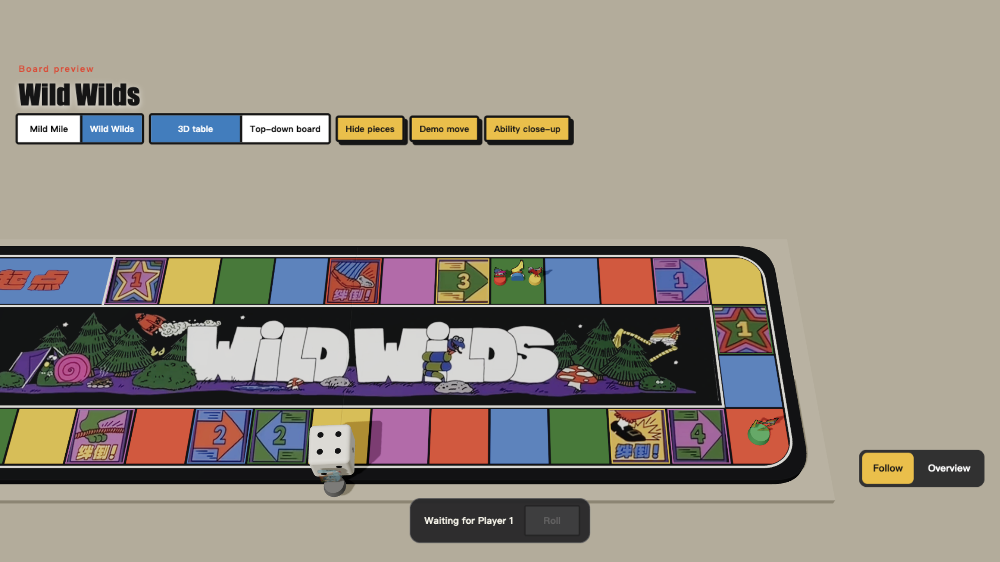
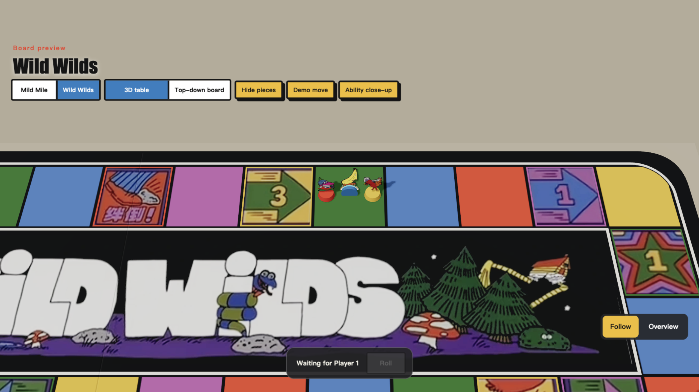
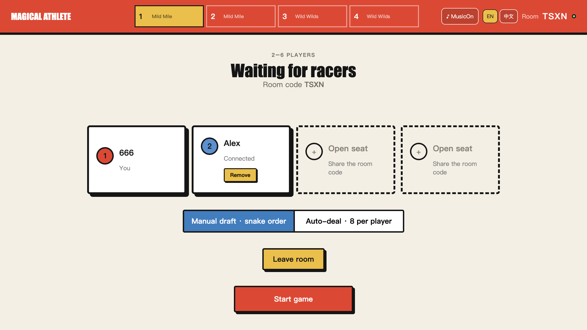
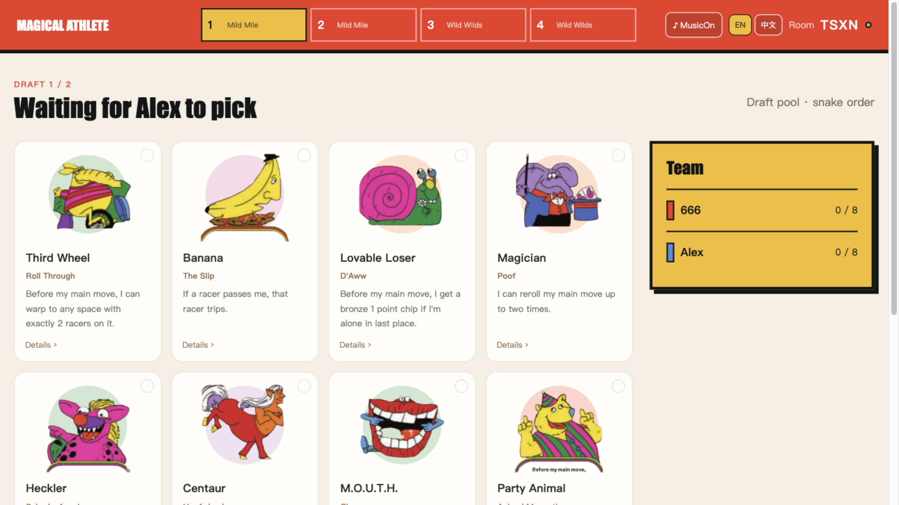

<h1 align="center">Magical Athlete Online</h1>

<h3 align="center">The magical, chaotic track meet — playable in any browser</h3>

<p align="center">
  <a href="https://magical-athlete.pages.dev/"><b>Play online</b></a> |
  <a href="docs/rules.md"><b>Rules</b></a> |
  <a href="docs/protocol.md"><b>Protocol</b></a> |
  <a href="#architecture"><b>Architecture</b></a> |
  <a href="README.zh-CN.md"><b>简体中文</b></a>
</p>

<p align="center">
  <a href="https://github.com/xeonliu/MagicalAthelete/actions/workflows/deploy.yml"></a>
  
  
  
  
</p>

<p align="center">
  <a href="https://magical-athlete.pages.dev/">
    
  </a>
</p>

## About

Magical Athlete Online is a browser implementation of the [CMYK board game of the same name](https://www.cmyk.games/products/magical-athlete) with **real-time multiplayer for 2–6 players**. Create a four-letter room code, invite your friends, and play through an open snake draft, secret racer selection, and four wildly unpredictable magical races. The host can also switch to auto-deal before the game starts and skip the draft entirely, or fill empty seats with bots that roll and pick skills on their own.

Dice rolls, movement, athlete abilities, scoring, and phase progression all run on the server, so every player watches the same race.

## Highlights

- **Complete game flow**: open draft, secret selection, four fixed races, and cumulative scoring in one pass; the host can switch to auto-deal and skip the draft.
- **Bots with a brain**: the host can seat up to six bots; they roll their own dice, draft, and resolve every interactive skill through the same rule engine.
- **36 magical athletes**: built on the `magsim` rule engine, each with its own interactive ability.
- **Real-time multiplayer rooms**: WebSocket state broadcast with reconnect, identity restore, and action de-duplication.
- **Server-authoritative rules**: clients cannot decide dice values or skip phases; the rules live in exactly one place.
- **Immersive race table**: Mild Mile and Wild Wilds board art, 3D racer pieces, and physics dice rendered together.
- **Follow camera and action playback**: the camera focuses on the racer that moves or triggers an ability, replays movement tile by tile, and calls out abilities, trips, and finishes. Switch to the overview camera at any time.
- **Interactive ability choices**: options and a countdown appear whenever a player has to decide; the related roll is shown first, then the choice.
- **Cloud persistence**: production rooms are snapshotted in a Cloudflare Worker with Durable Objects.

## Screenshots

### The 3D race table

<p align="center">
  
</p>

<p align="center"><sub>Wild Wilds in the local board preview: printed board art, racer pieces, and physics dice rendered in one 3D scene.</sub></p>

### Follow camera and ability close-ups

<p align="center">
  
</p>

<p align="center"><sub>An ability close-up in the local preview. During a real race the camera cuts between events to show movement, abilities, and the finish; the bottom-right control switches between the follow and overview cameras.</sub></p>

### Waiting room

<p align="center">
  
</p>

<p align="center"><sub>Creating a room gives you a four-letter code and a share link. Once 2–6 players take a seat, the host starts the game; before that, the host can add bots and switch between manual draft and auto-deal.</sub></p>

### Public draft

<p align="center">
  
</p>

<p align="center"><sub>Build your team from the public athlete pool. The draft order comes from a dice roll and then snakes back and forth between rounds; the host can also enable auto-deal before the game and skip the draft.</sub></p>

## Quick start

### Play with friends

1. Open [Play online](https://magical-athlete.pages.dev/), enter a player name, and create a room.
2. Send the room code to your friends and wait for 2–6 players; the host starts the game. Missing a player? The host can add bots from the lobby and they will play every roll and skill choice automatically.
3. Roll two dice to decide the draft order, then build your team from the public pool in snake order. If the host enables "Auto-deal" before the game starts, the draft is skipped and everyone gets 4 random cards (8 in the double-racer variant).
4. Each race, secretly pick your racers and lock the lineup, then roll to decide who goes first.
5. On your turn, click "Roll" or drag the dice on the table into the board and release. When ability options appear, pick one before the countdown ends.
6. After each race's results, the host advances to the next race. After four races, players are ranked by total points.

During a race, use "Follow / Overview" to switch cameras and "Racers & abilities" to expand this race's athlete cards. In landscape, tapping "Race feed" at the top docks the event list to the right and narrows the board into the left half; tap it again to collapse it.

Two-player games field two racers per race; three-player games let the host choose the double-racer variant before the start.

### Docker Compose

Run this from the repository root:

```bash
docker compose up --build
```

Open [http://localhost:8080](http://localhost:8080) to create a room. Use a private/incognito window or a second device to join the same room and test the multiplayer flow locally.

### Run from source

You need Node.js 20+ and Python 3.12+, and [uv](https://docs.astral.sh/uv/) is recommended.

```bash
# Terminal 1: authoritative game server
cd apps/server
uv sync --extra dev
uv run uvicorn magical_athlete.main:app --reload

# Terminal 2: web client
cd apps/web
npm ci
npm run dev
```

Open [http://localhost:5173/MagicalAthleteOL/](http://localhost:5173/MagicalAthleteOL/). Vite proxies `/api` and `/ws` to `localhost:8000`.

To look at the board only, start the frontend and open the [local 3D preview](http://localhost:5173/MagicalAthleteOL/race3d-preview.html). The preview can switch between both boards, 3D and top-down views, demo moves, and ability close-ups with no backend running. The board screenshots above come from this preview page using demo racer state.

## Architecture

```text
┌──────────────────────────────────────────────────────────────┐
│  apps/web · React + TypeScript                              │
│  room and athlete UI · React Three Fiber · Rapier · PixiJS  │
└───────────────────────────┬──────────────────────────────────┘
                            │ JSON / WebSocket
┌───────────────────────────▼──────────────────────────────────┐
│  apps/server · FastAPI / Cloudflare Worker                  │
│  RoomManager · connections, reconnects, broadcast, rooms     │
├──────────────────────────────────────────────────────────────┤
│  GameEngine · pure state-transition port                    │
│  MagsimGameEngine · 36 athletes and the official rules      │
└───────────────────────────┬──────────────────────────────────┘
                            │ production snapshots
┌───────────────────────────▼──────────────────────────────────┐
│  Cloudflare Durable Objects · serial actions, persisted rooms│
└──────────────────────────────────────────────────────────────┘
```

| Module | Responsibility |
| --- | --- |
| [`apps/web`](apps/web) | Room, draft, selection, race, and results UI; 3D dice and race rendering |
| [`apps/server`](apps/server) | Accepts player intents, advances authoritative state serially, and broadcasts events |
| [`apps/server/src/magsim`](apps/server/src/magsim) | Vendored rule engine and the 36 athlete abilities |
| [`docs`](docs) | Frozen rules, protocol, architecture plan, and original gameplay reference |
| [`infra/Caddyfile`](infra/Caddyfile) | Same-origin reverse proxy for the local container setup |

## Rules implementation

Races use an open snake draft and four rounds of secret selection (the host can switch to auto-deal), with a fixed schedule of `Standard, Standard, WildWilds, WildWilds`. Two-player games use the double-racer rules; in three-player games the host can choose the standard or double-racer variant.

The server resolves start-of-turn abilities automatically and then advances to either an ability choice or `WAITING_FOR_ROLL`. Only the active player can roll; the main move, reaction abilities, track-tile effects, and end of turn are all resolved in order by the state machine. A race ends immediately once the second racer crosses the finish line.

## Documentation

These documents are written in Chinese.

| Document | Contents |
| --- | --- |
| [Rule constants](docs/rules.md) | The physical rules and match constraints the implementation must follow |
| [Protocol](docs/protocol.md) | WebSocket connections, message formats, and protocol versioning |
| [3D race table plan](docs/3d-race-plan.md) | Target architecture, implementation phases, and acceptance criteria |
| [How to play (PDF)](docs/How_to_play_Magical_Athlete_compressed.pdf) | The original gameplay reference |

## Development and testing

```bash
# Run the server and frontend test suites
make test

# Build the production frontend (replace with the real backend HTTPS origin)
VITE_API_ORIGIN=https://<worker>.<subdomain>.workers.dev make build
```

You can also run `cd apps/server && uv run pytest` and `cd apps/web && npm test` separately.

## Deployment

After a push to `main`, [GitHub Actions](.github/workflows/deploy.yml) runs the Python tests, the frontend tests, and the production build, then publishes GitHub Pages. The Cloudflare Worker is deployed separately with the Pywrangler flow below. The live site is [xeonliu.github.io/MagicalAthleteOL](https://xeonliu.github.io/MagicalAthleteOL/).

<details>
<summary><b>Cloudflare and GitHub Pages configuration</b></summary>

Before the first deployment, create a Cloudflare API Token scoped to this repository only. The minimum permissions are Workers Scripts: Edit and Workers Durable Objects: Edit on the account; if the account UI already includes Durable Objects under Workers Scripts, no broader permission is needed. The account must also have Python Workers, Durable Objects, WebSocket hibernation, and alarms enabled.

The GitHub repository needs:

- Actions variable: `CLOUDFLARE_API_ORIGIN=https://<worker>.<subdomain>.workers.dev`
- Settings > Pages > Source: `GitHub Actions`

The current workflow only tests and publishes Pages; it does not deploy the Worker. The Cloudflare credentials are for the manual release flow below, and this Pages workflow needs no Cloudflare secrets.

Share links look like `https://xeonliu.github.io/MagicalAthleteOL/#/room/ABCD`.

</details>

<details>
<summary><b>Local debugging and releasing the Cloudflare Worker</b></summary>

Pywrangler currently needs `uv >= 0.8.10`, Python 3.13, and Node 20/22 LTS. Do not use Node 26: Pyodide 3.13.2 passes `--experimental-wasm-stack-switching`, which Node 26 removed.

```bash
brew install node@22
export PATH="$(brew --prefix node@22)/bin:$PATH"

uv sync
uv run pywrangler dev
curl http://localhost:8787/api/health
```

To release from your machine the first time, log in to Cloudflare in the browser:

```bash
uv run pywrangler login
uv run pywrangler deploy --dry-run
uv run pywrangler deploy
```

You can also set `CLOUDFLARE_ACCOUNT_ID` and `CLOUDFLARE_API_TOKEN` and deploy with an API Token scoped to this repository. The first real deploy creates the `v1` migration for `RoomDurableObject`.

The production frontend build uses the same Worker origin:

```bash
cd apps/web
VITE_API_ORIGIN=https://<worker>.<subdomain>.workers.dev npm run build
```

To roll back the Worker, pick the previous version under Workers & Pages > Deployments in the Cloudflare dashboard; for Pages, re-run an earlier successful commit in GitHub Actions. Do not delete or roll back a migration tag that `wrangler.toml` has already applied. Snapshot format upgrades must add compatible reads or an explicit migration first; never overwrite `schemaVersion` directly.

</details>

## Code provenance

Third-party code in this repository is used under its own license. The [server-side rules](apps/server/src/magsim) are modified from [`pschonev/magsim`](https://github.com/pschonev/magsim) (license: [`magsim-LICENSE`](apps/server/THIRD_PARTY_LICENSES/magsim-LICENSE)).

The Magical Athlete name, rules, and artwork belong to their respective rights holders.
